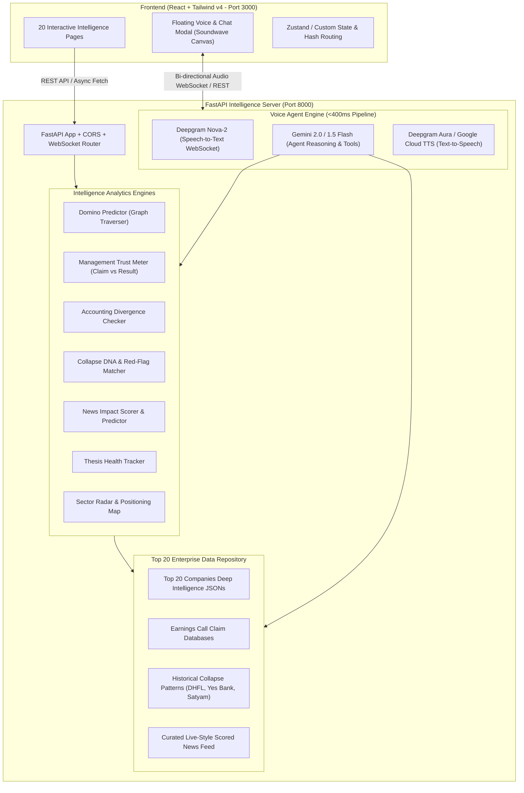
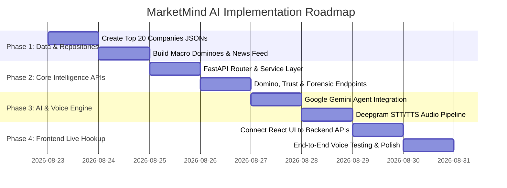

# 🧠 MarketMind AI — Master Backend, Voice Agent & Intelligence Architecture

> **Project Goal**: Transform MarketMind AI from a static frontend into an elite, full-stack, autonomous financial intelligence terminal powered by **FastAPI**, **Google Gemini AI**, **Deepgram Voice AI**, and a structured **Top 20 Companies Intelligence Repository**.

---

## 📑 Table of Contents
1. [Executive Summary & High-Rank Project Vision](#1-executive-summary--high-rank-project-vision)
2. [Complete System Architecture Diagram](#2-complete-system-architecture-diagram)
3. [Required API Keys & Configuration](#3-required-api-keys--configuration)
4. [Voice Agent Engine Architecture (Deepgram + Google Gemini)](#4-voice-agent-engine-architecture-deepgram--google-gemini)
5. [Top 20 Companies Structured Intelligence Repository](#5-top-20-companies-structured-intelligence-repository)
6. [Advanced Intelligence Engines Blueprint](#6-advanced-intelligence-engines-blueprint)
   - *Market Domino Predictor (Causality Chains)*
   - *Management Trust Meter (Call Promises vs Reality)*
   - *Accounting Reality Checker & Red-Flag DNA*
   - *Live News Scoring & Prediction Engine*
   - *Investment Thesis Breaker & Ghost Portfolio*
7. [Backend Folder & File Structure (Production Ready)](#7-backend-folder--file-structure-production-ready)
8. [Step-by-Step Implementation Roadmap](#8-step-by-step-implementation-roadmap)

---

## 1. Executive Summary & High-Rank Project Vision

Most stock applications show basic price charts, P/E ratios, and raw news feeds. **MarketMind AI reaches the top tier by focusing on "Why and What Next" rather than just "What Happened"**:

| Traditional Stock App | MarketMind AI Intelligence Terminal |
| :--- | :--- |
| Shows stock price went down 3% | Traces **4-order domino causality**: Oil +30% → Jet fuel spike → IndiGo margins −220bps → Ticket prices +10% → Hotel occupancy drag. |
| Reports quarterly net profit +20% | **Accounting Reality Checker**: Flags that while profit is +20%, operating cash flow is −15% and receivables spiked 40% (earnings quality risk). |
| Basic search bar & text chatbot | **Real-Time Ultra-Low Latency Voice Agent** speaking Indian-accented English & Hindi with domain-specific financial knowledge. |
| Alert only on price movements | **Investment Thesis Breaker**: Alerts when the *original reason you bought* breaks (e.g., revenue growth slowing below thesis threshold). |
| Simple news list | **News Intelligence Engine**: Scores news (1-100), tags Benefit/Loss/Neutral, and predicts 1–2 session impact. |

---

## 2. Complete System Architecture Diagram



---

## 3. Required API Keys & Configuration

To run both local development (with zero API costs) and production AI features, here are the required services:

### 🔑 1. Google Gemini API Key (`GEMINI_API_KEY`)
- **Provider**: Google AI Studio ([https://aistudio.google.com/](https://aistudio.google.com/))
- **Model Recommendation**: `gemini-1.5-flash` or `gemini-2.0-flash-exp` (Ultra-fast, 1M token context, sub-second responses, generous free tier).
- **Purpose**:
  - Voice agent core intelligence & conversational context.
  - Analyzing news headlines to generate impact scores & price predictions.
  - Generating one-click comprehensive PDF research reports.
  - Auditing earnings call transcripts against financial filings.

### 🎙️ 2. Deepgram API Key (`DEEPGRAM_API_KEY`)
- **Provider**: Deepgram ([https://deepgram.com/](https://deepgram.com/)) — *$200 Free Credit on Signup*
- **Models**:
  - **STT (Speech-to-Text)**: `nova-2` (Specifically optimized for financial terms, numbers, Indian English / Hindi accents, <200ms latency).
  - **TTS (Text-to-Speech)**: `aura-asteria-en` or `aura-orion-en` (Human-like conversational pacing without robotic artifacts).
- **Fallback**: Web Speech API (`SpeechRecognition` & `speechSynthesis`) inside the browser for 100% offline functionality.

### 📰 3. Financial Market & News APIs (Optional / Hybrid)
- **Primary Mode (Hackathon / Demo / Fast Local Testing)**: **Self-Contained Top 20 Companies Structured Data** (Instant load times, 100% offline reliability, zero rate limits).
- **Live Mode Integration**:
  - `NEWS_API_KEY` (NewsAPI.org) or `FINNHUB_API_KEY` (Finnhub Stock API) or `ALPHA_VANTAGE_API_KEY` for live price updates when desired.

### ⚙️ Backend `.env` Template
```env
# Server
PORT=8000
ENVIRONMENT=development
CORS_ORIGINS=["http://localhost:3000","http://127.0.0.1:3000"]

# AI Providers
GEMINI_API_KEY=your_google_gemini_api_key_here
DEEPGRAM_API_KEY=your_deepgram_api_key_here

# Voice Settings
DEFAULT_VOICE_MODEL=aura-asteria-en
DEFAULT_STT_MODEL=nova-2
VOICE_LANGUAGE=en-IN

# Feature Flags
USE_MOCK_DATA=true
ENABLE_WEBSOCKET_VOICE=true
```

---

## 4. Voice Agent Engine Architecture (Deepgram + Google Gemini)

The Voice Assistant is designed with a **Sub-500ms End-to-End Latency Pipeline**:

```
[User Speaks Mic Input]
        │ (Audio Stream / PCM chunks)
        ▼
1. Deepgram Nova-2 (STT) ───► Transcribes speech into text in ~120ms
        │
        ▼
2. MarketMind Context Engine ───► Injects relevant data (e.g. Current Reliance P/E, RSI, ESG score)
        │
        ▼
3. Google Gemini 1.5/2.0 Flash ───► Streams concise, natural, spoken answer (~180ms)
        │
        ▼
4. Deepgram Aura / Google TTS ───► Streams natural audio back to browser (~150ms)
        │
        ▼
[Audio Output & Animated Soundwave on Screen]
```

### 🧠 Voice Agent Tool Capabilities (Function Calling):
The Voice Agent is equipped with custom tools:
1. `get_stock_summary(ticker: str)`: Returns price, RSI, net margin, and recent signals.
2. `trace_domino_effect(event: str)`: Traces 1st to 4th order ripples for any economic event.
3. `get_management_trust(company: str)`: Returns kept vs broken promises score.
4. `explain_financial_term(term: str)`: Returns beginner-friendly 20-word voice explanations.
5. `generate_stock_report(ticker: str)`: Prepares a one-page summary download.

---

## 5. Top 20 Companies Structured Intelligence Repository

To ensure lightning-fast responses, demo perfection, and deep analytical depth, the backend will feature a curated `backend/data/companies/` directory covering India's top 20 conglomerates across 8 critical sectors:

```
backend/data/
├── companies/
│   ├── reliance.json        # Energy, Retail & Telecom
│   ├── tcs.json             # IT Services & Global Cloud
│   ├── hdfcbank.json        # Banking & Credit
│   ├── infy.json            # IT Services & Enterprise Software
│   ├── icicibank.json       # Retail Banking & Loans
│   ├── hul.json             # FMCG & Rural Demand
│   ├── itc.json             # Cigarettes, Hotels & Agribusiness
│   ├── sbi.json             # Public Sector Banking
│   ├── airtel.json          # Telecom & ARPU Growth
│   ├── lt.json              # Infrastructure & Defense
│   ├── bajfinance.json      # Consumer Lending & Fintech
│   ├── tatamotors.json      # Commercial Vehicles, EV & JLR
│   ├── sunpharma.json       # Specialty Pharma & US Generics
│   ├── axisbank.json        # Corporate & Retail Banking
│   ├── ongc.json            # Upstream Oil Exploration
│   ├── ntpc.json            # Power Generation & Green Hydrogen
│   ├── tatasteel.json       # Global Metals & European Ops
│   ├── maruti.json          # Passenger Vehicles & Hybrid Auto
│   ├── adanient.json        # Airports, Coal & Green Energy
│   └── spicejet.json        # Aviation & Forensic Case Study
├── failures/
│   ├── dhfl_2019.json       # Receivables & Credit Cascade
│   ├── yesbank_2020.json    # Hidden NPA & Governance Failure
│   └── satyam_2009.json     # Fictitious Cash Balances
├── macro_dominos.json       # 15 Pre-mapped Global Macro Ripple Events
└── news_feed.json           # Scored & Classified Real-Time News Stream
```

### 📊 Each Company Schema Contains:
1. **Core Fundamentals**: Ticker, Sector, Current Price, Market Cap, P/E, P/B, Net Margin, ROE, Debt/Equity.
2. **Technical & Chart Signals**: RSI, 50/200 DMA, Active Candlestick Patterns (Bullish Engulfing, Hammer, Doji).
3. **ESG Ratings**: Overall score (0-100), Environmental breakdown, Social score, Governance disclosures.
4. **Management Trust Claims**: Chronological list of earnings call promises, target deadlines, actual verified outcomes (`Kept`, `Delayed`, `Broken`), and verbatim call quotes.
5. **Forensic & Accounting Flags**: 4-quarter Reported Profit vs Operating Cash Flow divergence, Receivables growth rate vs Revenue growth rate, Short-term debt growth.
6. **DNA Fingerprint**: Trait ratings on Growth Ambition, Debt Tolerance, News Sensitivity, Management Reliability, and Market Fear.
7. **Supply Chain & Macro Dependencies**: Exposure to USD/INR, Brent Crude, US IT Spending, Interest Rates, Monsoon.

---

## 6. Advanced Intelligence Engines Blueprint

###  domino 1. Market Domino Predictor (Causality Engine)
- **Input**: An economic shock (e.g. `Crude Oil +30%`, `RBI Rate Cut 50bps`, `US Tech Spending Cut 15%`).
- **Algorithm**: Multi-layer Directed Acyclic Graph (DAG) traversal mapping:
  - **1st Order**: Direct Input Costs (e.g., ATF fuel cost increases 30%).
  - **2nd Order**: Margin & Profitability Compression (e.g., Airlines operating margins drop 220bps).
  - **3rd Order**: Consumer Pricing Response (e.g., Airfares surge 8–12%, demand elasticity kicks in).
  - **4th Order**: Secondary Ecosystem Impact (e.g., Leisure hotels occupancy declines, tourism stocks drag).
- **Company Mapping**: Tags affected stocks with impact severity (`Hit`, `Pass-Through`, `Beneficiary`, `Drag`).

### ⚖️ 2. Management Trust Meter (Accountability Engine)
- **Concept**: Cross-referencing management promises against verifiable audit data.
- **Scoring Formula**:
  $$\text{Trust Score} = \left( \frac{\text{Kept Promises} \times 1.0 + \text{Delayed Promises} \times 0.4 - \text{Broken Promises} \times 1.0}{\text{Total Promises Evaluated}} \right) \times 100$$
- **Output**: Detailed timeline of promises, exact quarter statements were made, and current status.

### 🔍 3. Accounting Reality Checker & Red-Flag DNA
- **Detection Rules**:
  1. **Profit vs Cash Flow Divergence**: Reported Net Profit $\uparrow$, Operating Cash Flow $\downarrow$ for $\ge 2$ quarters.
  2. **Aggressive Revenue Recognition**: Accounts Receivable Growth Rate $> 1.5 \times$ Revenue Growth Rate.
  3. **Liquidity Plug**: Short-Term Borrowings $\uparrow > 25\%$ while cash balances decline.
- **Red-Flag DNA Matcher**: Cosine similarity match against historical collapse templates (DHFL, Yes Bank, Satyam).

### 📰 4. News Intelligence & Real-Time Prediction Engine
- **Processing Flow**:
  1. Headline & Article ingestion.
  2. Gemini extraction: Target tickers, affected sector, sentiment polarity.
  3. Impact Assessment: Categorized into `Benefit` (Green), `Loss` (Red), or `Neutral` (Gold).
  4. Scoring: Impact Score calculated based on balance sheet sensitivity (1–100).
  5. Predictive Forecast: 1–2 session predictive insight linking historical post-news returns.

### 🎯 5. Investment Thesis Breaker & Ghost Portfolio
- **Thesis Tracker**: Tracks user reason for buying (e.g., "Reliance Retail 20% growth") vs live financial metrics. Alerts when thesis degrades even if stock price is artificially floating.
- **Ghost Portfolio**: Tracks decisions where user rejected or exited a stock early, calculating "Real Return vs Ghost Return" to identify recurring cognitive biases (e.g., selling winners too early).

---

## 7. Backend Folder & File Structure (Production Ready)

```
marketmind-ai/backend/
├── main.py                  # FastAPI entrypoint, CORS, Middleware & Routers
├── requirements.txt         # Dependencies (fastapi, uvicorn, google-genai, deepgram-sdk, etc.)
├── config.py                # Pydantic Settings & Environment Variables
├── data/                    # Top 20 Companies Repository
│   ├── companies/           # Detailed JSON profiles for Reliance, TCS, HDFC Bank, etc.
│   ├── failures/            # Historical autopsy case studies (DHFL, Yes Bank, Satyam)
│   ├── macro_dominos.json   # Pre-calculated causality chains
│   └── news_feed.json       # Rich initial news dataset
├── routes/
│   ├── __init__.py
│   ├── voice.py             # Voice Agent STT/TTS & Gemini Chat endpoints
│   ├── stocks.py            # Quotes, Fundamentals, Sector Comparison & ESG
│   ├── domino.py            # Domino Predictor causality graph API
│   ├── trust.py             # Management Trust Meter API
│   ├── forensic.py          # Accounting Checker & Red-Flag DNA API
│   ├── news.py              # Scored News Feed & Prediction API
│   ├── thesis.py            # Thesis Breaker & Ghost Portfolio API
│   └── reports.py           # AI PDF Report Generation API
├── services/
│   ├── __init__.py
│   ├── gemini_service.py    # Google Gemini AI agent & tool orchestration
│   ├── deepgram_service.py  # Deepgram Speech-to-Text & Text-to-Speech integration
│   ├── domino_service.py    # Causality graph engine logic
│   ├── trust_service.py     # Promise verification scoring logic
│   ├── forensic_service.py  # Accounting anomaly detection algorithm
│   └── news_service.py      # Impact scoring & predictive modeling
└── models/
    ├── __init__.py
    ├── stock_models.py      # Pydantic models for Stock data & metrics
    ├── voice_models.py      # Audio request/response models
    └── intelligence_models.py # Models for Domino, Trust, Thesis, Autopsy
```

---

## 8. Step-by-Step Implementation Roadmap



### 🚀 Next Actionable Steps:
1. **Scaffold `backend/data/companies/`** with rich datasets for India's Top 20 companies.
2. **Build Modular Service & Route Architecture** in FastAPI.
3. **Integrate Google Gemini & Deepgram Voice Agents** for real-time natural spoken audio conversation.
4. **Connect React Frontend** to consume live intelligence endpoints from port `8000`.
