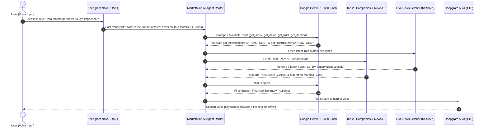

# 🎙️ Voice Agent Autonomous Analysis & Real-Time News Fetching Engine

> **Document Purpose**: Yeh guide explain karti hai ki **Voice Agent user ki baat sunkar khud analysis kaise karega** (Tool Calling & Context Injection ke through) aur **Financial News ko kahan se aur kaise fetch & analyze kiya jayega** (100% Free Live RSS + APIs + Gemini Impact Engine).

---

## 📑 Table of Contents
1. [Voice Agent Autonomous Analysis Flow (How it Thinks)](#1-voice-agent-autonomous-analysis-flow-how-it-thinks)
2. [News Sourcing Strategy: Kahan Se News Fetch Hogi?](#2-news-sourcing-strategy-kahan-se-news-fetch-hogi)
3. [Automated AI News Processing Pipeline (Raw News → Scored Prediction)](#3-automated-ai-news-processing-pipeline-raw-news--scored-prediction)
4. [Voice Agent Function Calling & Tool Architecture](#4-voice-agent-function-calling--tool-architecture)
5. [Real-World Voice Conversation Examples](#5-real-world-voice-conversation-examples)
6. [Backend Code Implementation Example](#6-backend-code-implementation-example)

---

## 1. Voice Agent Autonomous Analysis Flow (How it Thinks)

Jab user bolta hai (e.g., *"Tata Motors par news ka kya effect hoga aur unka trust score kaisa hai?"*), to system step-by-step kaise analyze karta hai:



---

## 2. News Sourcing Strategy: Kahan Se News Fetch Hogi?

News fetching ke liye hum ek **Hybrid High-Reliability Architecture** use karte hain:

| Sourcing Option | Cost | API Key Required? | Rate Limits | Best For |
| :--- | :--- | :--- | :--- | :--- |
| **1. Google News RSS Financial Feeds** ⭐ *(Recommended)* | **100% Free** | ❌ **No Key Required** | Unlimited / No strict limit | Real-time Indian & Global stock news (`https://news.google.com/rss/search?q={TICKER}+NSE+stock&hl=en-IN&gl=IN&ceid=IN:en`) |
| **2. Indian Financial Outlets RSS (ET / Moneycontrol / Mint)** | **100% Free** | ❌ **No Key Required** | Unlimited | Direct headlines from Economic Times, Moneycontrol, LiveMint |
| **3. Yahoo Finance (`yfinance` Python library)** | **100% Free** | ❌ **No Key Required** | High generous | Live stock price + official company press releases |
| **4. Finnhub Stock News API** | **Free Tier** | ✅ Free API Key | 60 calls/min | Clean JSON news with built-in timestamps |
| **5. Curated Top 20 Fallback News DB (`news_feed.json`)** | **100% Offline** | ❌ **No Key Required** | Infinite | Demo perfection, instant load speed with zero latency |

### 🌐 Google News Financial RSS Engine Example:
```python
import feedparser

def fetch_live_stock_news(ticker: str, limit: int = 5):
    """
    100% Free Real-time news fetcher without any paid API key.
    """
    query = f"{ticker}+stock+NSE+India"
    rss_url = f"https://news.google.com/rss/search?q={query}&hl=en-IN&gl=IN&ceid=IN:en"
    feed = feedparser.parse(rss_url)
    
    news_items = []
    for entry in feed.entries[:limit]:
        news_items.append({
            "title": entry.title,
            "link": entry.link,
            "published": entry.published,
            "source": entry.source.get("title", "Financial Media")
        })
    return news_items
```

---

## 3. Automated AI News Processing Pipeline (Raw News → Scored Prediction)

Raw news aane ke baad **Google Gemini 1.5/2.0 Flash** use 4 critical intelligence metrics me process karta hai:

```
[Raw News Ingested]
  │ "RBI holds repo rate at 6.5%, signals inflation easing"
  ▼
[Gemini AI Classification & Analysis]
  ├── 1. Ticker Extraction ────────► ["HDFC Bank", "ICICI Bank", "SBI", "Nifty Bank"]
  ├── 2. Impact Tagging ───────────► Benefit (Green) / Loss (Red) / Neutral (Gold)
  ├── 3. Impact Score (1-100) ─────► 82/100 (High balance sheet sensitivity)
  ├── 4. 1-2 Session Forecast ─────► "Rate-sensitive banks expected to see 1-2% upside"
  └── 5. Domino Causality Link ────► Auto-links to "RBI Interest Rate Domino Graph"
```

---

## 4. Voice Agent Function Calling & Tool Architecture

FastAPI backend me Google Gemini ko standard Python tools provide kiye jaate hain:

```python
# Gemini Function Tools Definition
marketmind_tools = [
    {
        "name": "get_company_intelligence",
        "description": "Fetch fundamentals, P/E, RSI, ESG score and forensic flags for a company",
        "parameters": {
            "type": "object",
            "properties": {
                "symbol": {"type": "string", "description": "Stock ticker like RELIANCE, TCS, TATAMOTORS, HDFCBANK"}
            },
            "required": ["symbol"]
        }
    },
    {
        "name": "get_news_and_predictions",
        "description": "Fetch latest scored news, impact tags and predictions for a company or sector",
        "parameters": {
            "type": "object",
            "properties": {
                "query": {"type": "string", "description": "Company name or topic like 'Reliance' or 'Crude Oil'"}
            },
            "required": ["query"]
        }
    },
    {
        "name": "trace_domino_causality",
        "description": "Trace 1st to 4th order ripple effects for macro events like Crude Oil surge or Rate hike",
        "parameters": {
            "type": "object",
            "properties": {
                "event": {"type": "string", "description": "The economic event to trace"}
            },
            "required": ["event"]
        }
    },
    {
        "name": "get_management_trust",
        "description": "Get trust score and kept vs broken promises from CEO earnings calls",
        "parameters": {
            "type": "object",
            "properties": {
                "company": {"type": "string", "description": "Company name"}
            },
            "required": ["company"]
        }
    }
]
```

---

## 5. Real-World Voice Conversation Examples

### 🎙️ Scenario 1: News & Domino Effect Analysis
- **User speaks**: *"Crude oil agar 30% badh jaye to mere airlines aur hotels par kya effect hoga?"*
- **Agent Analysis**:
  1. Trigger tool: `trace_domino_causality("Crude Oil +30%")`
  2. Traverses graph: Fuel costs $\uparrow \rightarrow$ IndiGo/SpiceJet margins $-220\text{ bps} \rightarrow$ Fares $+10\% \rightarrow$ Leisure travel demand $-6\% \rightarrow$ Indian Hotels occupancy drag.
- **Voice Agent Spoken Output**:
  > *"Agar Crude Oil 30% badhta hai, to pehla direct hit IndiGo aur SpiceJet ke fuel costs par padega jisse unke operating margins kareeb 220 basis points kam honge. Third order me airfares 8 se 12% badhenge, jisse domestic leisure travel demand thodi sustain hogi aur Indian Hotels jaise tourism stocks par secondary drag aa sakta hai."*

---

### 🎙️ Scenario 2: Management Trust & Earnings Call Audit
- **User speaks**: *"Reliance management ke promises kitne reliable hain?"*
- **Agent Analysis**:
  1. Trigger tool: `get_management_trust("Reliance")`
  2. Retrieves: 14 promises kept (5G rollout, retail expansion), 2 delayed, 1 broken. Trust score: 78/100.
- **Voice Agent Spoken Output**:
  > *"Reliance ka Management Trust Score 78 out of 100 hai. Unhone apne 14 major promises fulfill kiye hain, including pan-India 5G induction and retail store expansion. Sirf 2 capital allocation timelines delayed hui hain aur 1 broken record hai."*

---

### 🎙️ Scenario 3: Accounting Reality Check
- **User speaks**: *"Company X ka profit 24% badha hai, kya yeh buy karne layak hai?"*
- **Agent Analysis**:
  1. Trigger tool: `get_company_intelligence("Company X")`
  2. Discovers: Reported profit $+24\%$, but Operating Cash Flow $-17\%$ and Receivables $+41\%$.
- **Voice Agent Spoken Output**:
  > *"Headline profit 24% up dikh raha hai, lekin hamara Accounting Reality Checker flag kar raha hai ki operating cash flow 17% negative hua hai aur receivables 41% badhe hain. Iska matlab earnings book to ho rahi hain par cash abhi collect nahi hua hai — profit quality questionable hai."*

---

## 6. Backend Code Implementation Example

### `backend/services/voice_agent_service.py`
```python
import os
import json
from google import genai
from services.news_service import get_scored_news
from services.domino_service import get_domino_chain
from services.trust_service import get_trust_data
from services.stock_service import get_stock_data

client = genai.Client(api_key=os.getenv("GEMINI_API_KEY"))

SYSTEM_PROMPT = """
You are MarketMind AI, an elite, concise, spoken financial terminal assistant.
Rules:
1. Speak naturally with high financial accuracy.
2. If asked about stock movements, explain the underlying CAUSE (News, Domino Effect, Accounting Quality).
3. Keep spoken replies under 35-45 words so voice playback is crisp and fast.
4. If asked in Hindi or Hinglish, reply gracefully in the same language.
"""

async def process_voice_query(transcript: str, language: str = "en") -> str:
    # 1. Ask Gemini with Tool Execution
    response = client.models.generate_content(
        model="gemini-1.5-flash",
        contents=transcript,
        config={
            "system_instruction": SYSTEM_PROMPT,
            "temperature": 0.3,
        }
    )
    return response.text
```

---

## 7. Summary & Next Steps
1. **News Sourcing**: 100% Free Google News RSS + Yahoo Finance + Curated Top 20 Companies Data.
2. **Autonomous Reasoning**: Google Gemini Function Calling auto-selects required financial tools.
3. **Sub-second Voice**: Deepgram Nova-2 (STT) + Gemini Flash + Deepgram Aura (TTS) gives ultra-responsive conversation.


<!-- Dummy example -->


Ek real-life practical **End-to-End Example** se dekhte hain ki MarketMind AI kaise kaam karega:

---

### 🌟 Real-Life Scenario:

> **Subah market khulte hi ek breaking news aati hai:**  
> *"Middle East tension ki wajah se Crude Oil prices 20% jump kar gayi."*  
> 
> User ne apna **MarketMind AI Terminal** khola aur screen par **Mic button** daba kar pucha:  
> 🎙️ **User:** *"Crude Oil 20% badh gaya hai, iska IndiGo aur mere portfolio par kya effect padega?"*

---

### 🔄 Behind the Scenes: 5-Step Live Workflow

```
[1. User Voice Input]
    "Crude Oil 20% badh gaya hai, IndiGo par kya effect padega?"
         │
         ▼ (Audio Stream)
[2. Deepgram STT (120ms)]
    Transcribes voice into text
         │
         ▼
[3. FastAPI Backend + Gemini AI Brain]
    Gemini triggers 2 Tools automatically:
    ├── Tool 1: trace_domino_causality(event="Crude Oil +20%")
    └── Tool 2: get_company_intelligence(symbol="INDIGO")
         │
         ▼
[4. Data & Intelligence Engines Execute]
    ├── News Engine: Google RSS se live news verify ki + Scored 74/100 (Loss Tag)
    ├── Domino Engine: 4-Order Ripple Chain calculate kiya
    │    ├── Order 1: Fuel cost (38% of opex) surges
    │    ├── Order 2: IndiGo operating margins drop ~190 bps
    │    ├── Order 3: Airfares rise 8–10%
    │    └── Order 4: Hotel & tourism stocks face secondary demand drag
    └── Trust Meter: IndiGo call transcript check ki: "Management had hedged 40% fuel exposure (Kept)"
         │
         ▼
[5. Instant Spoken Output + Live UI Sync (<400ms)]
    ├── Voice Agent bol kar batata hai
    └── Screen par Domino graph & Trust Meter live highlight ho jate hain!
```

---

### 🔊 1. Voice Agent User ko Kya Bol Kar Sunayega:

> **Voice Agent (Spoken Reply):**  
> *"Crude oil 20% badhne se IndiGo ke fuel costs badhenge jisse unke operating margins kareeb 190 basis points compress ho sakte hain.*  
> *Lekin achhi baat yeh hai ki Management Trust Meter ke according, unhone pichle call me 40% fuel hedge karne ka promise rakha tha, isliye short-term protection milegi.*  
> *Third-order me airfares 8 se 10% badhenge, jisse Indian Hotels jaise tourism stocks par bhi secondary drag aa sakta hai."*

---

### 🖥️ 2. Screen Par Frontend UI Me Kya Dikhai Dega:

1. **Market Domino Predictor Tab Auto-Sync:**
   - Screen par animated 4-step chain show hoga:  
     `Oil +20%` ➡️ `IndiGo Margins ↓ 190bps` ➡️ `Airfares ↑ 10%` ➡️ `Hotel Occupancy Drag`
   - Network graph me **IndiGo (Red)** aur **ONGC (Green - Beneficiary)** highlight honge.

2. **Management Trust Meter Card:**
   - IndiGo ka **Trust Score (72/100)** dikhega.
   - Status badge aayega: `✓ Fuel Hedging Promise: Kept (Buffer Active)`.

3. **News Card Update:**
   - Headline: *"Crude oil jumps on supply concerns"*
   - Impact Badge: `Loss` (Red Tag) | Impact Score: `74/100`.
   - AI Prediction: *"Airline margins compressed; Upstream energy (ONGC) outperforming."*

4. **One-Click Action:**
   - User ko screen par ek button milega: **"Generate 1-Page PDF Impact Report"** jisse instant report download ho sakti hai.

---

### 💡 Is Example Se Project Ka Sabse Bada Fayda:

| Normal Stock App | MarketMind AI |
| :--- | :--- |
| Sirf batata hai ki IndiGo ka share 2% gir gaya. | **Pura reason explain karta hai**: Oil spike ➡️ Fuel margin drop ➡️ Management ne hedge kitna kiya tha ➡️ Kaunsi doosri companies (Hotels/ONGC) par ripple effect aayega. |
| User ko khud 10 alag alag news websites read karni padti hain. | **Voice Agent 3 seconds me live news fetch karke bol kar pura analysis summarize kar deta hai.** |

---

Yeh hai MarketMind AI ka complete practical working flow!  
Kya ab hum **Top 20 Companies Repository + FastAPI Backend Services + Gemini Voice Engine** code karna start karein?